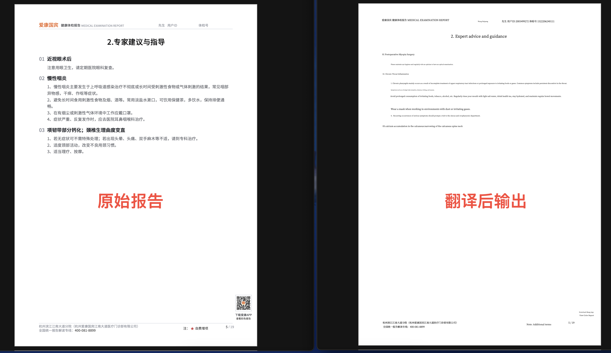
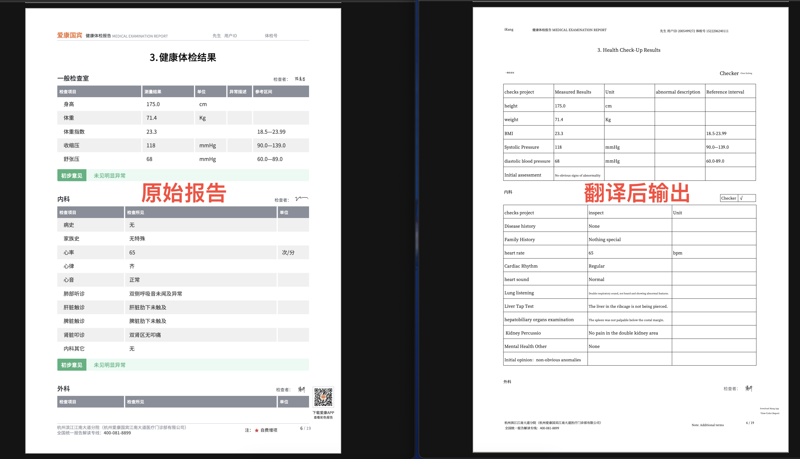
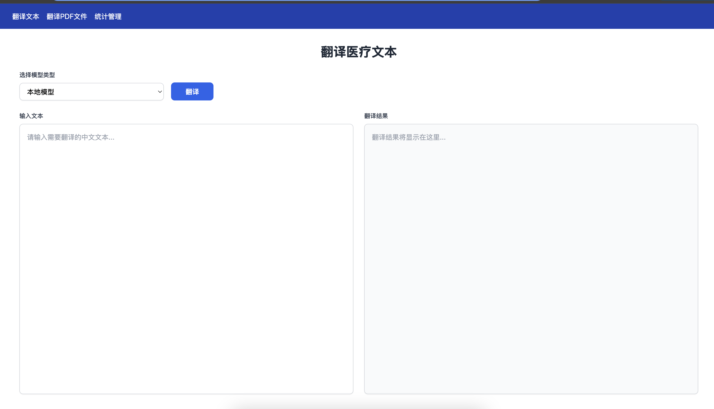
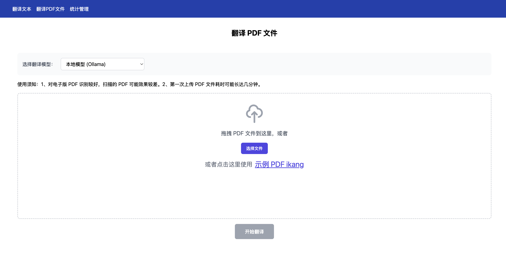
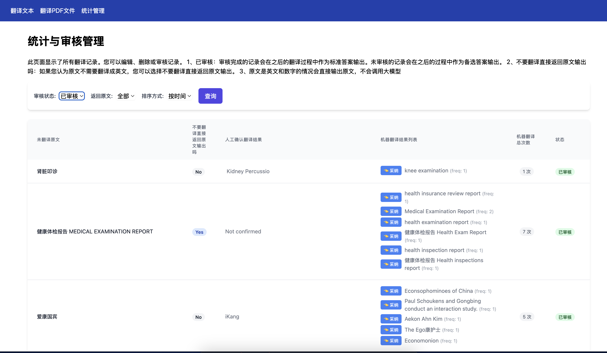

# MedicalPDFTranslate
Auto translate Chinese Medical Report PDF to English.
支持中文体检报告 PDF 自动翻译为英文，并且保持原文的排版结构不变，可实现翻译后的英文报告跟原文对应的格式排版。


## 更新记录
- 2025/02/11 完成项目，支持 docker compose 一键部署


# 项目简介

对中文体检报告 PDF 文件识别，并且调用翻译接口，翻译成英文，生成英文版本的体检报告 PDF 文件。
1、对电子版体检报告 PDF 文件支持效果良好。对扫描版体检报告 PDF 文件支持效果不好。
2、支持调用本地大语言模型进行翻译，可以本地通过 ollama 部署 deepseek 进行翻译。
3、支持调用第三方翻译接口，如腾讯云在线的 deepseek模型，也可以通过修改 url 调用其它在线模型进行翻译。

本项目基于开源项目
- MinerU是一款将PDF转化为机器可读格式的工具（如markdown、json），可以很方便地抽取为任意格式。


# 主要功能

- 分析体检报告 PDF 的排版信息，识别体检报告的图片，然后调用翻译接口，翻译成英文，生成英文版本的体检报告 PDF 文件。

# 预览效果








# 快速开始

使用 docker 安装

1、下载项目
配置.env 文件
修改 HOST_IP 为宿主机IP，或域名，域名需要修改 docker-compose.yml 文件中的端口，然后使用 nginx 代理。
```bash
HOST_IP=192.168.211.119 # 宿主机IP
```

2、恢复数据库(可选)
```bash
# 停止所有容器
docker-compose down

# 启动一个临时的 PostgreSQL 容器来修复权限
docker run --rm -v ${PWD}/postgres_data:/var/lib/postgresql/data postgres:15-alpine chown -R postgres:postgres /var/lib/postgresql/data

```
如何备份数据库
```bash
# 确保容器在运行中
docker exec translation_postgres pg_dump -U translator translations > backup.sql
```
3、如何启动容器
```bash
docker composer build
docker composer up -d
```
4、然后
打开浏览器访问 浏览器访问 localhost:3300 


# 更多配置
以下内容参考 MinerU 项目

#### 下载模型权重文件

详细参考 [如何下载模型文件](docs/how_to_download_models_zh_cn.md)

#### 修改配置文件以进行额外配置

修改用户目录下的magic-pdf.json文件，配置默认模型路径。
您可在【用户目录】下找到magic-pdf.json文件。

> [!TIP]
> windows的用户目录为 "C:\\Users\\用户名", linux用户目录为 "/home/用户名", macOS用户目录为 "/Users/用户名"

您可修改该文件中的部分配置实现功能的开关，如表格识别功能：

> [!NOTE]
>如json内没有如下项目，请手动添加需要的项目，并删除注释内容（标准json不支持注释）

```json
{
    // other config
    "layout-config": {
        "model": "doclayout_yolo" // 使用layoutlmv3请修改为“layoutlmv3"
    },
    "formula-config": {
        "mfd_model": "yolo_v8_mfd",
        "mfr_model": "unimernet_small",
        "enable": true  // 公式识别功能默认是开启的，如果需要关闭请修改此处的值为"false"
    },
    "table-config": {
        "model": "rapid_table",  // 默认使用"rapid_table",可以切换为"tablemaster"和"struct_eqtable"，https://github.com/RapidAI/TableStructureRec?tab=readme-ov-file#%E6%8C%87%E6%A0%87%E7%BB%93%E6%9E%9C
        "sub_model": "slanet_plus",  // 当model为"rapid_table"时，可以自选sub_model，可选项为"slanet_plus"和"unitable"。https://github.com/RapidAI/RapidTable
        "enable": true, // 表格识别功能默认是开启的，如果需要关闭请修改此处的值为"false"
        "max_time": 400
    }
}
```
1、Rapid_table 可以 CPU 和 GPU：
slanet_plus和unitable的区别：
slanet_plus，模型大小6.8M，推理耗时 0.15s。对复杂表格支持不太好。
unitable，模型大小 500M，推理耗时 cpu 6s, GPU(Nvidia 4090) 1.5s。

2、struct_eqtable:必须使用 GPU
3、TableMaster：可以 CPU 和 GPU


### 使用GPU

如果您的设备支持CUDA，且满足主线环境中的显卡要求，则可以使用GPU加速，请根据自己的系统选择适合的教程：

- [Ubuntu22.04LTS + GPU](docs/README_Ubuntu_CUDA_Acceleration_zh_CN.md)
- [Windows10/11 + GPU](docs/README_Windows_CUDA_Acceleration_zh_CN.md)
- 使用Docker快速部署
> [!IMPORTANT]
> Docker 需设备gpu显存大于等于8GB，默认开启所有加速功能
> 
> 运行本docker前可以通过以下命令检测自己的设备是否支持在docker上使用CUDA加速
> 
> ```bash
> docker run --rm --gpus=all nvidia/cuda:12.1.0-base-ubuntu22.04 nvidia-smi
> ```
  ```bash
  wget https://gcore.jsdelivr.net/gh/opendatalab/MinerU@master/docker/china/Dockerfile -O Dockerfile
  docker build -t mineru:latest .
  docker run --rm -it --gpus=all mineru:latest /bin/bash -c "echo 'source /opt/mineru_venv/bin/activate' >> ~/.bashrc && exec bash"
  magic-pdf --help
  ```
### 使用NPU

如果您的设备存在NPU加速硬件，则可以通过以下教程使用NPU加速：

[NPU加速教程](docs/README_Ascend_NPU_Acceleration_zh_CN.md)

### 使用MPS
如果您的设备使用Apple silicon 芯片，您可以在部分支持的任务（layout检测/公式检测）中开启mps加速：

您可以通过在 `magic-pdf.json` 配置文件中将 `device-mode` 参数设置为 `mps` 来启用 MPS 加速。

```json
{
    // other config
    "device-mode": "mps"
}
```

> [!TIP]
> 由于公式识别任务无法开启mps加速，您可在不需要识别公式的任务关闭公式识别功能以获得最佳性能。
>
> 您可以通过将 `formula-config` 部分中的 `enable` 参数设置为 `false` 来禁用公式识别功能。


# License Information

[LICENSE.md](LICENSE.md)

本项目开源，但不提供任何形式的担保。由于本项目使用了 MinerU 项目的部分代码，本项目也遵循其开源协议：
MinerU 目前采用PyMuPDF以实现高级功能，但因其遵循AGPL协议，可能对某些使用场景构成限制。未来版本迭代中，我们计划探索并替换为许可条款更为宽松的PDF处理库，以提升用户友好度及灵活性。

# Acknowledgments

- [PDF-Extract-Kit](https://github.com/opendatalab/PDF-Extract-Kit)
- [DocLayout-YOLO](https://github.com/opendatalab/DocLayout-YOLO)
- [StructEqTable](https://github.com/UniModal4Reasoning/StructEqTable-Deploy)
- [RapidTable](https://github.com/RapidAI/RapidTable)
- [PaddleOCR](https://github.com/PaddlePaddle/PaddleOCR)
- [PyMuPDF](https://github.com/pymupdf/PyMuPDF)
- [layoutreader](https://github.com/ppaanngggg/layoutreader)
- [fast-langdetect](https://github.com/LlmKira/fast-langdetect)
- [pdfminer.six](https://github.com/pdfminer/pdfminer.six)


